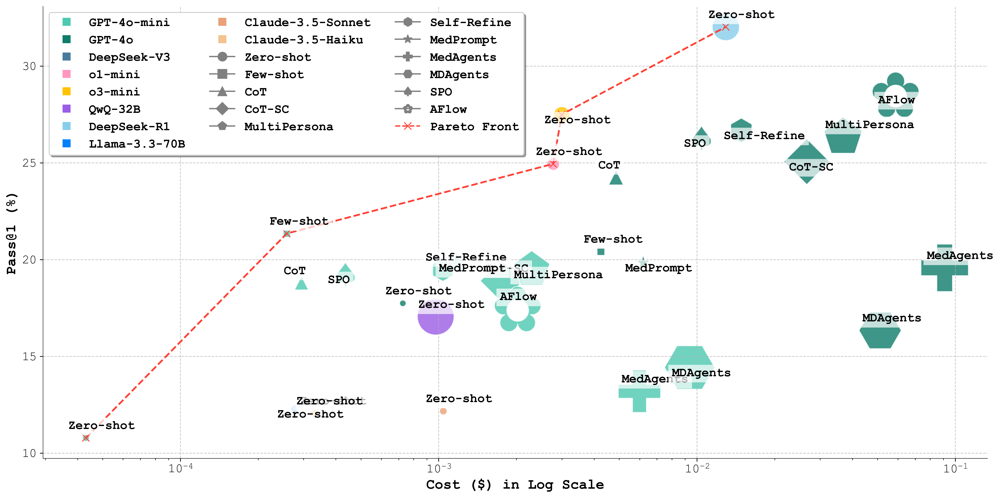
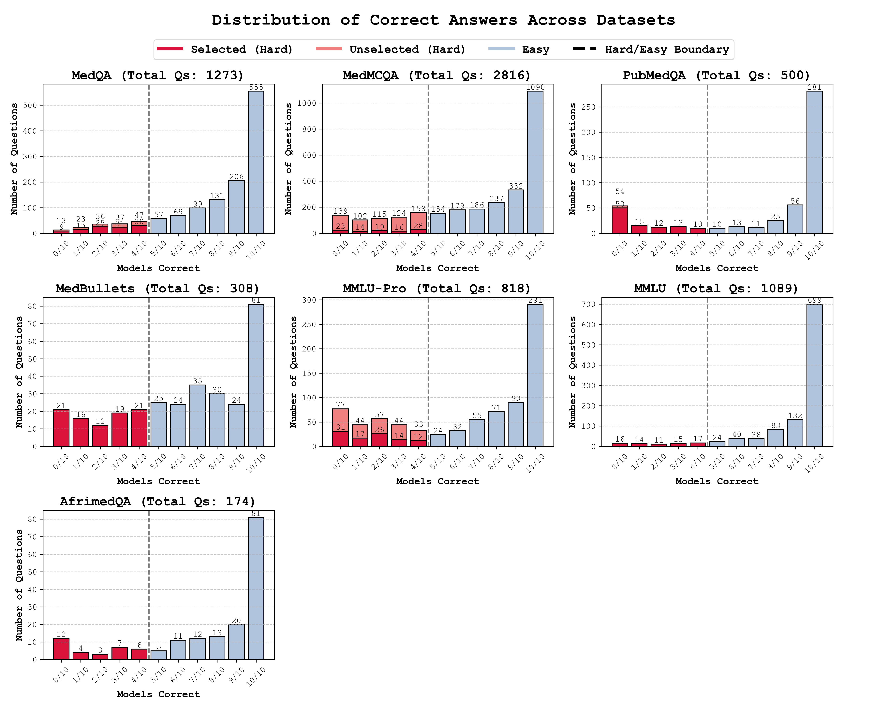

# MedAgents-Benchmark

This repository contains the evaluation benchmark for medical question-answering agents.

## Overview




## Installation

Please install the dependencies using the `requirements.txt` file.
```bash
pip install -r requirements.txt
```

Put all the environment variables in the `.env` file.

## Running Experiments

To run the baseline experiments:

1. Navigate to the respective baseline directory:
   - `baselines/MDAgents/`
   - `baselines/MedAgents/` 
   - `baselines/MedPrompt/`

2. Execute the experiment script:
   ```bash
   ./run_experiments_all.sh
   ```

3. For analyzing results and calculating error/success metrics, refer to `misc.ipynb`

## Dataset Statistics



The benchmark focuses on challenging medical questions, specifically selecting questions where models achieve less than 50% accuracy. The hard question distribution across tasks is:

| Task       | Number of Hard Questions |
|------------|-------------------------|
| medqa      | 100                     |
| pubmedqa   | 100                     |
| medmcqa    | 100                     |
| medbullets | 89                      |
| mmlu       | 73                      |
| mmlu-pro   | 100                     |
| afrimedqa  | 32                      |

All agent evaluations are conducted on this test_hard subset.

## Original Datasets

This benchmark includes several medical question-answering datasets that have been preprocessed into a standardized format:

### MedQA
- Multiple choice questions from medical licensing exams
- Contains train and test splits
- 4 answer options (A-D)
- Sampled 50 questions for evaluation

### PubMedQA 
- Questions based on PubMed abstracts
- 3 answer options (yes/no/maybe)
- Questions combine context from abstracts with the original question
- Sampled 50 questions for evaluation

### MedMCQA
- Single choice medical questions (filtered from multi-choice)
- Uses dev set as test set
- 4 answer options (A-D)
- Sampled 50 questions for evaluation

### AfriMedQA
- Multiple choice medical questions
- Variable number of options (A-J)
- Filtered to keep only single-answer MCQs
- Sampled 50 questions for evaluation

### MMLU (Medical Subset)
- Filtered to include only medical/biology domains:
  - Clinical knowledge
  - Professional medicine 
  - College medicine
  - Medical genetics
  - Anatomy
  - College biology
- 4 answer options (A-D)
- Sampled 50 questions for evaluation

### MMLU-Pro (Health Subset)
- Professional-level questions filtered to health category
- Includes domains like clinical knowledge, medicine, nutrition, anatomy
- Variable number of options (most common: 10 options)
- Sampled 50 questions for evaluation

### MedBullets
- Categorized into difficulty levels (easy/good/hard/bad)
- Includes detailed explanations
- Multiple choice format
- Sampled 50 questions from hard set for evaluation

All datasets have been standardized to include:
- Question text `question`
- Answer options `options` 
- Correct answer `answer_idx`
- Unique ID `realidx`

For example:
```json
{
    "question": "You are called to assess a term newborn... What is the most likely diagnosis?",
    "options": {
        "A": "Oesophageal atresia no fistula",
        "B": "Iatrogenic oesophageal perforation", 
        "C": "Oesophageal stenosis",
        "D": "Common type oesophageal atresia with mucus plugging of the distal tracheoesophageal fistula",
        "E": "N/A"
    },
    "answer_idx": "A",
    "realidx": "0fd14a5dcafa4c3054ea03245a10aa1262fb88bf4906cfcec09f73bee06b163c"
}